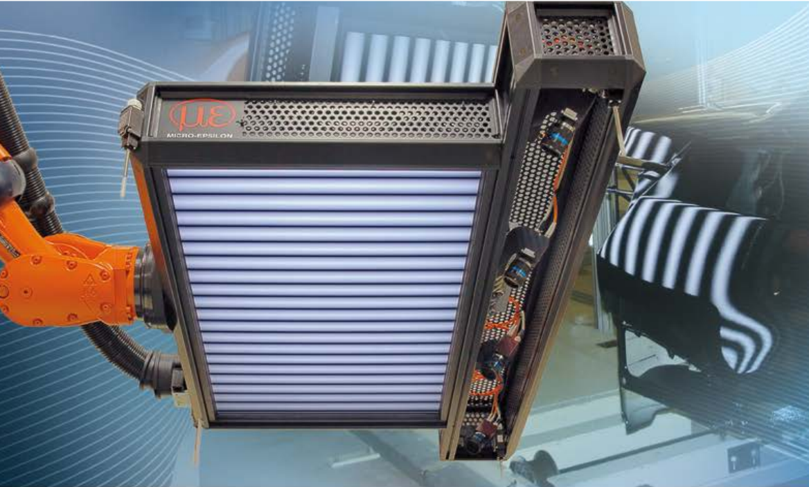
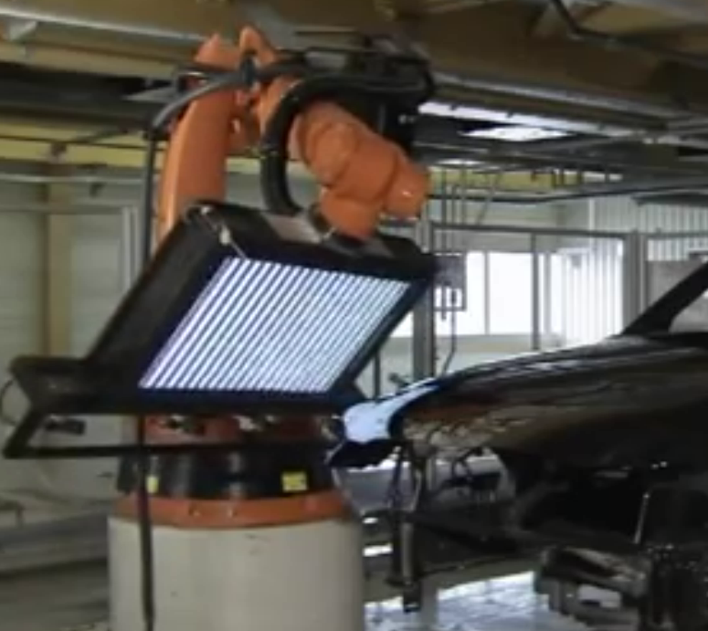
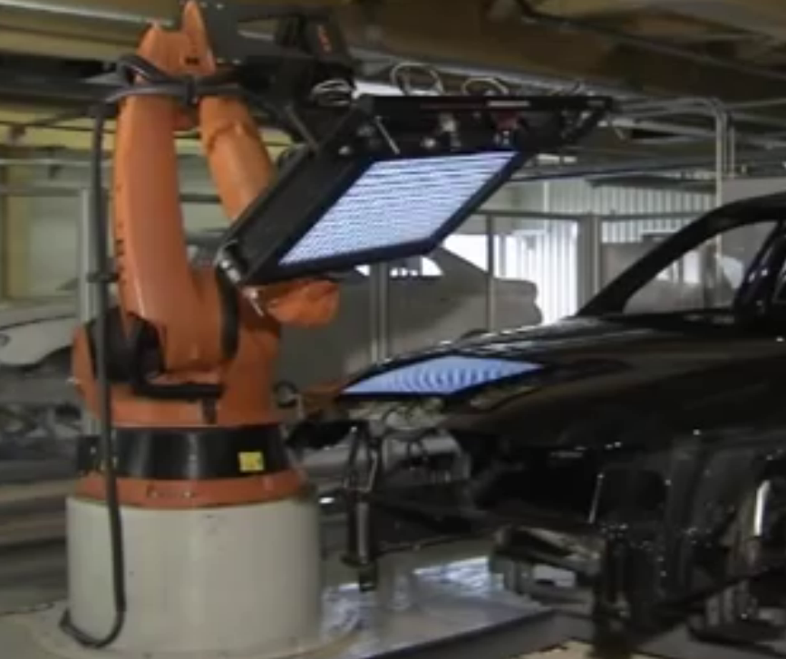

## 汽车外表面检测demo





## 使用说明
主要在[目录ImageProcess](64/ImageProcess)
```
├── ImageProcess
│   ├── camera  #相机拍摄的图片保存地址
│   ├── MvSdkLog #日志
│   ├── result #没一轮处理的结果图片保存地址
│   └── screen #投影的图片
```
使用先安装好opencv，不作说明
```shell
make
```
目录下会生成ImageProcess
连接上相机，直接运行`ImageProcess`就行了
```shell
./ImageProcess
```